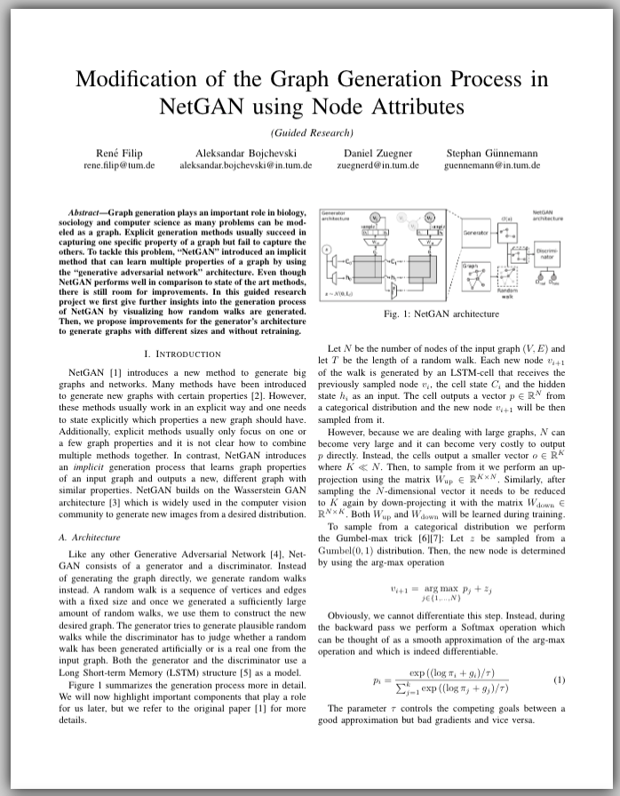

During the winter semester 2018/2019, I did a "guided research" project with the [Data Analytics and Machine Learning Group](https://www.in.tum.de/en/daml/home/) chair at TUM. Together with my advisors we modified one of their projects called [NetGAN](https://arxiv.org/pdf/1803.00816.pdf) that generates graphs (networks) using [Generative Adversarial Networks](https://de.wikipedia.org/wiki/Generative_Adversarial_Networks). You can find my report below.

[Download](../assets/generate-graphs-using-gans/report.pdf)
