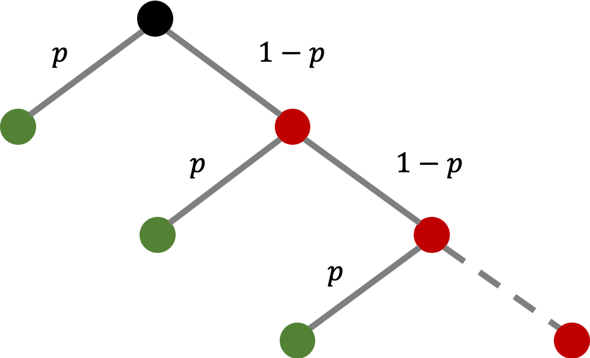
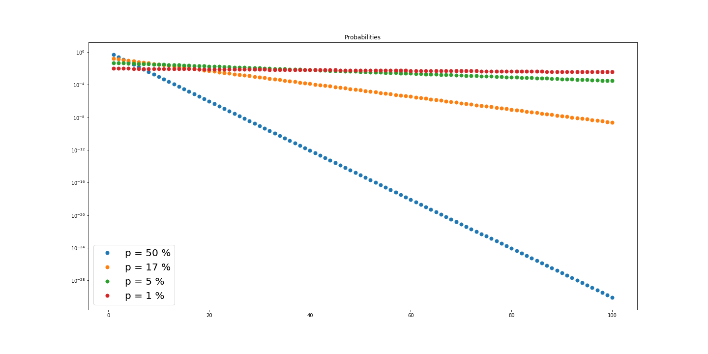
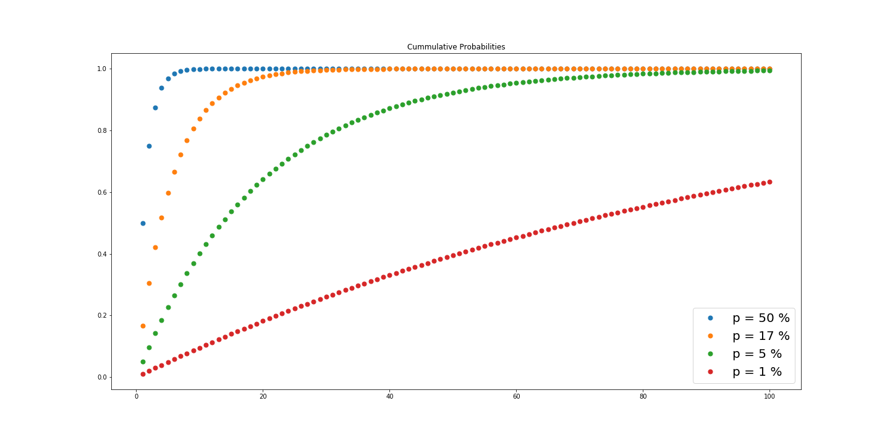
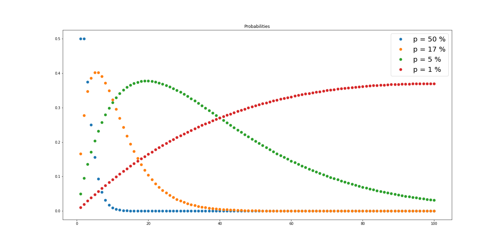

Assume someone challanges you for a dice rolling game. If you need 4 tries or less to roll a "six" you have to pay 10 € or else, you will receive 10 €. You can play as often as you want to. Would you play it? Despite it's weird rules, it does not look too bad. For instance, you know that it takes 6 tries until you roll a "six" in average. Obviously, on some occasions it will take less than that. But, on other occasions it will take either 6 or more tries since things need to balance out again. Even better, in the game above you only have to make sure that you don't roll a six in the first four tries and as long as you win more often than you lose, you will make a nice profit, right?

Well for starters, if someone tries to do this or something similar in real life, you can always assume that it is a scam. But regardless of that fact, you would indeed lose about 36 ct each game you play in the long run. Even though it takes 6 rolls in average, it is more likely that you only need 4 rolls than that you need more than that. It turns out that the average value (or more precisely, [expected value](https://en.wikipedia.org/wiki/Expected_value)) hides some important information from you because it aggregates a lot of things into one value only. In this blog post, I am going to show you how you can derive the same conclusion and how you can think about probabilities in general. This observation is also known as the [law of small numbers](https://en.wikipedia.org/wiki/Poisson_distribution#Law_of_rare_events).

## The Expected Value of Winning

In many games, we are dealing with a so called [Bernoulli experiment](https://en.wikipedia.org/wiki/Bernoulli_distribution). That means, there are only two possible outcomes: Rolling a six or not, flipping heads or tails, winning the lottery or not, etc. Assuming that getting outcome 1 has the probability $$0 < p_1 \le 1$$, then hitting the other outcome 2 comes with the probability $$p_2 = 1-p_1$$. If we repeat the experiment until we get a "success", then we arrive at a [geometric distribution](https://en.wikipedia.org/wiki/Geometric_distribution). By taking the inverse $$\frac{1}{p_1}$$, we get the expected value of the number of tries to get outcome 1 in the long run. That means, if we repeat the experiment over and over again and we keep track of whether we win or lose, then the average number of tries for outcome 1 is $$\frac{1}{p_1}$$. The table below shows some example events with their respected probabilities and expected values.

|Event $$E$$|Probability $$p$$|Expectation $$\mathbb{E}$$|
|-----|-----------|-----------|
|Flipping heads|$$\frac{1}{2} = 50\%$$|$$2$$|
|Rolling a "6" on a 6-sided dice (1d6)|$$\frac{1}{6} \approx 17\%$$|$$6$$|
|Rolling a "20" on a 20-sided dice (1d20)|$$\frac{1}{20} = 5\%$$|$$20$$|
|Finding a [shiny](https://bulbapedia.bulbagarden.net/wiki/Shiny_Pok%C3%A9mon) Pokémon|$$\frac{1}{8192} \approx 0.0122\%$$|$$8192$$|
|Winning Lotto: 49 choose 6|$$\binom{49}{6} \approx 0.0000071\%$$|$$13983816$$|

But why is it exacly $$\frac{1}{p}$$? There are different ways to show this and I will present two of them.

### Method 1: "Recursively"

The expected value in the discrete case is a weighted average or the "arithemetic mean" of something. Repeating an experiment until we win costs us $$\mathbb{E}$$ tries in average. We know that we need to roll the dice at least once at the beginning, no matter what. That means, we have a "cost" of 1 in that single instance. Now, if we hit the "six" already, we are done and we do not have to "pay" anything else. Otherwise, we repeat the same experiments which costs us $$\mathbb{E}$$ again. Written mathematically,

$$
\mathbb{E} = 1 + p \cdot 0 + (1-p) \mathbb{E} = 1 + (1-p) \mathbb{E} = 1 + \mathbb{E} - p \mathbb{E}
$$

Notice that $$\mathbb{E}$$ appears on both sides of the equation. To conclude, we just solve for $$\mathbb{E}$$ by rearranging the terms.

$$
\begin{aligned}
\mathbb{E} &= 1 + \mathbb{E} - p \mathbb{E} \\
\Leftrightarrow 0 &= 1 - p \mathbb{E} \\
\Leftrightarrow p\mathbb{E} &= 1 \\
\Leftrightarrow \mathbb{E} &= \frac{1}{p}
\end{aligned}
$$

### Method 2: "Iteratively"

A slightly more complicated way to show this is by using the [polylogarithm](https://en.wikipedia.org/wiki/Polylogarithm) function (also known as Jonquière's function). There seems to be a lot of fancy math going on and I don't know too much about it, but the function provides a solution for the two following infinite sums which we will use in a moment. Let $$z$$ be real. If $$z < 1$$, then the following infinite sums are finite (i.e. they converge).

$$
\begin{aligned}
\sum_{t=1}^\infty z^t &= \frac{z}{1-z}  < \infty \\
\sum_{t=1}^\infty t z^{t} &= \frac{z}{(1-z)^2} < \infty
\end{aligned}
$$

From school you may remember that we often draw (binary) trees when we visualize probabilities. They make it very easy to figure out certain events. We will use the following tree but this time, it has an "infinite" depth.

Let the [random variable](https://en.wikipedia.org/wiki/Random_variable) $$T$$ keep track of the number of tries. The probability of getting the desired outcome in the first try (first green node) is $$\Pr(T=1) = p$$. For the second try (second green node) it is $$\Pr(T=2) = (1-p) p$$. For the third try it is $$\Pr(T=3) = (1-p)^2 p$$. In fact, we quickly notice a pattern. For try $$t$$, the probability is $$\Pr(T=t) = (1-p)^{t-1} p$$. To calculate $$\mathbb{E}$$, we multiply these probabilities with the costs, namely the number of tries. Therefore, we have

$$
\mathbb{E}[T] = p \cdot 1 + (1-p)p \cdot 2 + (1-p)^2 p \cdot 3 + \dotsb = \sum_{t=1}^\infty (1-p)^{t-1} p \cdot t
$$

What's left to do is to solve that expession which is not too difficult if we use the two infinite sums from before and rearrange the terms a bit. Namely,

$$
\begin{aligned}
\mathbb{E}[T] &= \sum_{t=1}^\infty (1-p)^{t-1} p \cdot t = p \sum_{t=1}^\infty t (1-p)^{t-1} \\
&= p \sum_{t=0}^\infty (t+1) (1-p)^t = p \sum_{t=0}^\infty \left(  t (1-p)^t + (1-p)^t \right) \\
&= p \left( \sum_{t=0}^\infty t(1-p)^t + \sum_{t=0}^\infty (1-p)^t \right) = p \left( \sum_{t=1}^\infty t{\underbrace{(1-p)}_{z < 1}}^t + 1 + \sum_{t=1}^\infty {\underbrace{(1-p)}_{z<1}}^t \right) \\
&= p \left( \frac{z}{(1-z)^2} + 1 + \frac{z}{1-z} \right) = p \left( \frac{1-p}{p^2} + 1 + \frac{1-p}{p} \right) \\
&= \frac{p(1-p)}{p^2} + p + \frac{p(1-p)}{p} = \frac{1-p}{p} + \frac{p^2}{p} + \frac{p(1-p)}{p} \\
&= \frac{1-p+p^2 + p - p^2}{p} = \frac{1}{p}
\end{aligned}
$$

Obviously, both methods come to the same result. But the second method might be a bit more insightful.

## What's the probability for a given number of tries?

The formula $$\Pr(T=t) = (1-p)^{t-1} p$$ is quite powerful. We can make a table and some plots to get a feeling for certain common probabilities. Now, we can answer how likely it is to roll a six in *exactly* $$t$$ tries and also *exactly or less than* $$t$$ tries.

|Try $$t$$|Coin Flip|6-sided Dice|20-sided Dice|1 in 100|
|---------|----------------------|-------------|--------|
|$$T = 1$$|$$ 50.0\%$$|$$ 16.7 \%$$|$$ 5.0 \%$$|$$ 1.0 \%$$|
|$$T = 2$$|$$ 25.0\%$$|$$ 13.9 \%$$|$$ 4.8 \%$$|$$ 1.0 \%$$|
|$$T = 3$$|$$ 12.5\%$$|$$ 11.6 \%$$|$$ 4.5 \%$$|$$ 1.0 \%$$|
|$$T = 4$$|$$ 6.2\%$$|$$ 9.6 \%$$|$$ 4.3 \%$$|$$ 1.0 \%$$|
|$$T = 5$$|$$ 3.1\%$$|$$ 8.0 \%$$|$$ 4.1 \%$$|$$ 1.0 \%$$|
|$$T = 6$$|$$ 1.6\%$$|$$ 6.7 \%$$|$$ 3.9 \%$$|$$ 1.0 \%$$|
|$$T = 7$$|$$ 0.8\%$$|$$ 5.6 \%$$|$$ 3.7 \%$$|$$ 0.9 \%$$|
|$$T = 8$$|$$ 0.4\%$$|$$ 4.7 \%$$|$$ 3.5 \%$$|$$ 0.9 \%$$|
|$$T = 9$$|$$ 0.2\%$$|$$ 3.9 \%$$|$$ 3.3 \%$$|$$ 0.9 \%$$|
|$$T = 10$$|$$ 0.1\%$$|$$ 3.2 \%$$|$$ 3.2 \%$$|$$ 0.9 \%$$|
|$$T = 11$$|$$ 0.0\%$$|$$ 2.7 \%$$|$$ 3.0 \%$$|$$ 0.9 \%$$|
|$$T = 12$$|$$ 0.0\%$$|$$ 2.2 \%$$|$$ 2.8 \%$$|$$ 0.9 \%$$|
|$$T = 13$$|$$ 0.0\%$$|$$ 1.9 \%$$|$$ 2.7 \%$$|$$ 0.9 \%$$|
|$$T = 14$$|$$ 0.0\%$$|$$ 1.6 \%$$|$$ 2.6 \%$$|$$ 0.9 \%$$|
|$$T = 15$$|$$ 0.0\%$$|$$ 1.3 \%$$|$$ 2.4 \%$$|$$ 0.9 \%$$|
|$$T = 16$$|$$ 0.0\%$$|$$ 1.1 \%$$|$$ 2.3 \%$$|$$ 0.9 \%$$|
|$$T = 17$$|$$ 0.0\%$$|$$ 0.9 \%$$|$$ 2.2 \%$$|$$ 0.9 \%$$|
|$$T = 18$$|$$ 0.0\%$$|$$ 0.8 \%$$|$$ 2.1 \%$$|$$ 0.8 \%$$|
|$$T = 19$$|$$ 0.0\%$$|$$ 0.6 \%$$|$$ 2.0 \%$$|$$ 0.8 \%$$|
|$$T = 20$$|$$ 0.0\%$$|$$ 0.5 \%$$|$$ 1.9 \%$$|$$ 0.8 \%$$|

For example, there is a $$8\%$$ chance that you need *exactly* 5 rolls to roll a "six".

We can also calculate the cummulative probabilities $$\Pr(T \le t) = (1-p)^{t-1} p$$ which is simply the sum of all terms from $$T=1$$ until $$T=t$$. That will give us some good estimation metrics as well.

|Try $$t$$|Coin Flip|6-sided Dice|20-sided Dice|1 in 100|
|---------|----------------------|-------------|--------|
|$$T \le 1$$|$$ 50.0\%$$|$$ 16.7 \%$$|$$ 5.0 \%$$|$$ 1.0 \%$$|
|$$T \le 2$$|$$ 75.0\%$$|$$ 30.6 \%$$|$$ 9.8 \%$$|$$ 2.0 \%$$|
|$$T \le 3$$|$$ 87.5\%$$|$$ 42.1 \%$$|$$ 14.3 \%$$|$$ 3.0 \%$$|
|$$T \le 4$$|$$ 93.8\%$$|$$ 51.8 \%$$|$$ 18.5 \%$$|$$ 3.9 \%$$|
|$$T \le 5$$|$$ 96.9\%$$|$$ 59.8 \%$$|$$ 22.6 \%$$|$$ 4.9 \%$$|
|$$T \le 6$$|$$ 98.4\%$$|$$ 66.5 \%$$|$$ 26.5 \%$$|$$ 5.9 \%$$|
|$$T \le 7$$|$$ 99.2\%$$|$$ 72.1 \%$$|$$ 30.2 \%$$|$$ 6.8 \%$$|
|$$T \le 8$$|$$ 99.6\%$$|$$ 76.7 \%$$|$$ 33.7 \%$$|$$ 7.7 \%$$|
|$$T \le 9$$|$$ 99.8\%$$|$$ 80.6 \%$$|$$ 37.0 \%$$|$$ 8.6 \%$$|
|$$T \le 10$$|$$ 99.9\%$$|$$ 83.8 \%$$|$$ 40.1 \%$$|$$ 9.6 \%$$|
|$$T \le 11$$|$$ 100.0\%$$|$$ 86.5 \%$$|$$ 43.1 \%$$|$$ 10.5 \%$$|
|$$T \le 12$$|$$ 100.0\%$$|$$ 88.8 \%$$|$$ 46.0 \%$$|$$ 11.4 \%$$|
|$$T \le 13$$|$$ 100.0\%$$|$$ 90.7 \%$$|$$ 48.7 \%$$|$$ 12.2 \%$$|
|$$T \le 14$$|$$ 100.0\%$$|$$ 92.2 \%$$|$$ 51.2 \%$$|$$ 13.1 \%$$|
|$$T \le 15$$|$$ 100.0\%$$|$$ 93.5 \%$$|$$ 53.7 \%$$|$$ 14.0 \%$$|
|$$T \le 16$$|$$ 100.0\%$$|$$ 94.6 \%$$|$$ 56.0 \%$$|$$ 14.9 \%$$|
|$$T \le 17$$|$$ 100.0\%$$|$$ 95.5 \%$$|$$ 58.2 \%$$|$$ 15.7 \%$$|
|$$T \le 18$$|$$ 100.0\%$$|$$ 96.2 \%$$|$$ 60.3 \%$$|$$ 16.5 \%$$|
|$$T \le 19$$|$$ 100.0\%$$|$$ 96.9 \%$$|$$ 62.3 \%$$|$$ 17.4 \%$$|
|$$T \le 20$$|$$ 100.0\%$$|$$ 97.4 \%$$|$$ 64.2 \%$$|$$ 18.2 \%$$|

For instance, you get a $$51.8\%$$ probability to roll a "six" in your first four tries. That is the reason why the game at the beginning is not in your favor.

$$
\mathbb{E} = 51.8 \% \cdot (-10\,€) + 48.2 \% \cdot 10\,€ = -0.36\,€
$$

I also made some simple plots for both tables which extends them to 100 tries. Notice that the first graphic has a log-scale. Otherwise, all lines would be drawn on each other.

## Probablity of less than/equal "expected" tries

Let's look into the probability of having *less or equal than "expected"* tries for a given probability $$p$$, i.e. $$\Pr(T \le \mathbb{E})$$. We will see that it is always more than $$63.2\%$$ for *any* probability. By looking at the binary tree again, we see that

$$
\begin{aligned}
\Pr(T \le \mathbb{E}) &= 1 - \Pr(T > \mathbb{E}) \\
&= 1 - \Pr\left(T > \frac{1}{p}\right) \\
&= 1 - (1-p)^{\frac{1}{p}}
\end{aligned}
$$

Let's make a handy table again.

|Event|Probability $$p$$|Expectation $$\mathbb{E}$$|$$\Pr(T \le \mathbb{E})$$|$$\Pr(T > \mathbb{E})$$|
|-----|-----------------|-------------------------|-----------------------|
|Flipping heads|$$50\%$$|$$2$$|$$ 75.0\%$$|$$ 25.0\%$$|
|Rolling a "6"|$$17\%$$|$$6$$|$$ 66.5\%$$|$$ 33.5\%$$|
|Rolling a "20"|$$5\%$$|$$20$$|$$ 64.2\%$$|$$ 35.8\%$$|
|1 in 100|$$1\%$$|$$100$$|$$ 63.4\%$$|$$ 36.6\%$$|
|Shiny Pokémon|$$0.0122\%$$|$$8192$$|$$ 63.2\%$$|$$ 36.8\%$$|
|Winning Lotto|$$0.0000071\%$$|$$13983816$$|$$ 63.2\%$$|$$ 36.8\%$$|

As promised, all probabilities for $$\Pr(T \le \mathbb{E})$$ are greater than $$63.2\%$$. The smaller the probability $$p$$, the closer $$\Pr(T \le \mathbb{E})$$ is to $$63.2\%$$ or $$\Pr(T > \mathbb{E})$$ to $$36.8\%$$. But what is so special about $$36.8\%$$ though? It looks innocent but it is a very special number as we will see now. We want to make the probability $$p$$ smaller and smaller and let it approach 0 from the right, i.e. $$p \to 0^+$$.

$$
\lim_{p \to 0^+} (1-p)^\frac{1}{p} 
$$

Calculating this limit is fun because we can utilize the famous [L'Hôpital's rule](https://en.wikipedia.org/wiki/L%27H%C3%B4pital%27s_rule). Whenever you encounter a limit (and you already know that it converges), you can try to plug in the variable direclty and see if you end up with something reasonable (usually you don't). Here, we would end up with something weird:

$$
(1-0^+)^\frac{1}{0^+} \Rightarrow 1^\infty 
$$

That does not look very reasonable because we don't end up with a "1" but with something slightly greater than that and we take it to a very high power. But, $$1^\infty$$ screams for applying L'Hôpital's rule. The idea is to rewrite the term as the fraction $$\frac{0}{0}$$ first and apply the rule second.

$$
\begin{aligned}
\lim_{p \to 0^+} (1-p)^\frac{1}{p} 
&= \lim_{p \to 0^+} \exp \ln \left( (1-p)^\frac{1}{p} \right) \\
&= \exp \lim_{p \to 0^+} \frac{\ln (1-p)}{p} \\
&\stackrel{\mathrm{H}}{=} \exp \lim_{p \to 0^+} \frac{\frac{\mathrm{d}}{\mathrm{d}p} \ln (1-p)}{\frac{\mathrm{d}}{\mathrm{d}p} p} \\
&= \exp \lim_{p \to 0^+} \frac{- \frac{1}{1-p}}{1} \\
&= \exp \lim_{p \to 0^+} - \frac{1}{1-p} \\
&= \exp(-1) \\
&= \frac{1}{e} \approx 36.8\%
\end{aligned}
$$

## What the expected value doesn't want you to know

You may or may not find it suprising that even though it is more likely to have less than 5 tries to roll a "six", the expected value is *still* 6 and not less. Let's visualize each single summand in the expected value, namely $$(1-p)^{t-1} p \cdot t$$.

If we sum up every dot, we end up with the expected value $$\mathbb{E}$$ of course. As we can see on on the graph, it is not very symmetrical. Even though it is more likely to have less/euqal $$t \le \mathbb{E}$$ tries, their summands don't contribute as much to the expected value as the terms $$t > \mathbb{E}$$ after the expected value. That also means that you get punished by a high number (of tries) when you happen to need more than $$\mathbb{E}$$ tries. I summarized this observation in the following table:

|Event|Probability|$$1$$ to $$\mathbb{E}$$|$$\mathbb{E}+1$$ to $$\infty$$|$$\mathbb{E}$$|
|-----|-----------|-------------------------|----------------------------|--------------|
|Coin flip |$$ 50\%$$|$$ 1.0$$|$$ 1.0$$|$$ 2$$|
|6-sided dice |$$ 17\%$$|$$ 2.0$$|$$ 4.0$$|$$ 6$$|
|20-sided dice |$$ 5\%$$|$$ 5.3$$|$$ 14.7$$|$$ 20$$|
|1 in 100 |$$ 1\%$$|$$ 26.4$$|$$ 73.6$$|$$ 100$$|

## Conclusion

The gist is, if you repeat an exeriment (for example you play a certain board game) very often and you don't change your strategy in a given situation, then you should still rely on the expected value as it gives you a better estimation for your long term success. Even though smaller sequences are more likely, larger ones will pop up and hurt you. However, if you only care about a short term success or you can change your strategy throughout, then the expected value is misleading and not a good estimation since it is too pessimistic.

